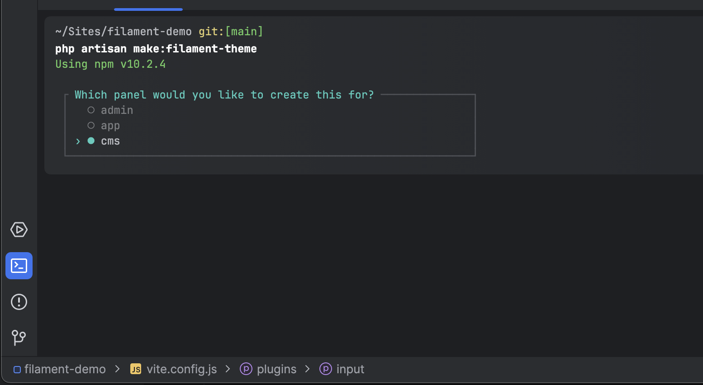
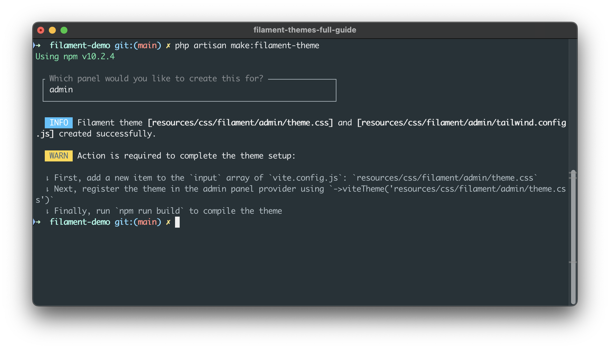

# Filament Custom Themes - The Full Guide
A Full Guide on how to create a custom Filament Theme for your Filament v3.0 Panels.

## Resources
- [Filament Docs](https://filamentphp.com/docs/)
- [Filament Official Documentation on Themes](https://filamentphp.com/docs/3.x/panels/themes#creating-a-custom-theme)

## Before You Start

I am assuming you already have a Filament Panel setup. If you don't have one, please set up a panel using the [official documentation guide](https://filamentphp.com/docs/3.x/panels/getting-started).

## Creating a theme

In this example, we will be creating a custom theme for a Panel named `cms`.

### Creating the theme using the terminal

In your project's root directory, run:

```bash
php artisan make:filament-theme
```

It will scan your app for all the panels you have created and let you select which panel this themes applies to. Select the panel it belongs to. In this particular case, we will select the panel `cms`.



After you've selected the panel, the terminal will give you all further instructions, but we'll go for each one step by step.



#### Editing vite.config.js

Go to the `vite.config.js` file in your project's root directory and set the input array like below:

```javascript
import { defineConfig } from 'vite'
import laravel, { refreshPaths } from 'laravel-vite-plugin'

export default defineConfig({
    plugins: [
        laravel.default({
            input: [
                'resources/css/app.css',
                'resources/js/app.js',
                // Added the following line of code
                'resources/css/filament/cms/theme.css'
            ],
            refresh: [
                ...refreshPaths,
                'app/Filament/**',
                'app/Forms/Components/**',
                'app/Livewire/**',
                'app/Infolists/Components/**',
                'app/Providers/Filament/**',
                'app/Tables/Columns/**',
            ],
        }),
    ],
})
```

See how we've added `resources/css/filament/cms/theme.css` to that array? This will tell vite where our custom theme is located when running the build process.

>[!note]
> If you have other themes, you can add them in the same array

#### Registering the viteTheme in our panel

Now we shall edit the `CmsPanelProvider.php` file and add the viteTheme method to our `$panel`, like the example below:

```php
return $panel
    ->id('cms')
    ->path('cms')
    // Added the following line of code
    ->viteTheme('resources/css/filament/cms/theme.css')
```

Our panel now knows we are using a custom theme created under that path.

#### Running the build process

At last, we shall run the build process with the terminal in our project's root directory:

```bash
npm run build
```

### Registering vendor files

Sometimes, when installing plugins like [Auth UI Enhancer](https://www.github.com/diogogpinto/filament-auth-ui-enhancer) or [Filament Curator](https://github.com/awcodes/filament-curator), for example, the docs say something to the effect of:

> 1. Add the plugin's views to your tailwind.config.js file.
> ```javascript
> content: [
>     './vendor/diogogpinto/filament-auth-ui-enhancer/resources/**/*.blade.php',
> ]```

What this means is, you need to make sure that when we start the building process, it checks the files in the paths specified to collect all used CSS classes in the plugin that you'll need when rendering it.

So, in our case, installing `Auth UI Enhancer` and `Curator`plugin in our panel, we will go to `resources/css/filament/cms/tailwind.config.js`and edit it like the code below:

```js
import preset from '../../../../vendor/filament/filament/tailwind.config.preset'

export default {
    presets: [preset],
    content: [
        './app/Filament/Clusters/Products/**/*.php',
        './resources/views/filament/clusters/products/**/*.blade.php',
        './vendor/filament/**/*.blade.php',
        './vendor/diogogpinto/filament-auth-ui-enhancer/resources/**/*.blade.php', // Added this line of code
        './vendor/awcodes/filament-curator/resources/**/*.blade.php',
    ],
}
```

Additionally, in the case of `Curator`, the plugin author requires you to import some CSS files in your `theme.css`. This can be done, by editing the file `resources/css/filament/cms/theme.css` and making it look like below:

```css
@import '/vendor/filament/filament/resources/css/theme.css';
@import '/node_modules/cropperjs/dist/cropper.css';
@import '/vendor/awcodes/filament-curator/resources/css/plugin.css';

@config 'tailwind.config.js';
```

What we're doing here is importing all the vendor CSS files so when we run the build process they will be compiled and minimized in the same CSS file.

#### Running the build process

When installing plugins and editing any theme related files, always remember to run `npm run build` when you're finished to compile all the assets.